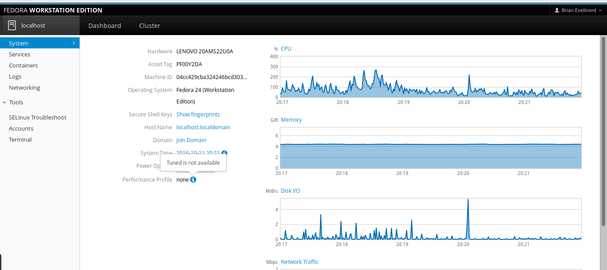
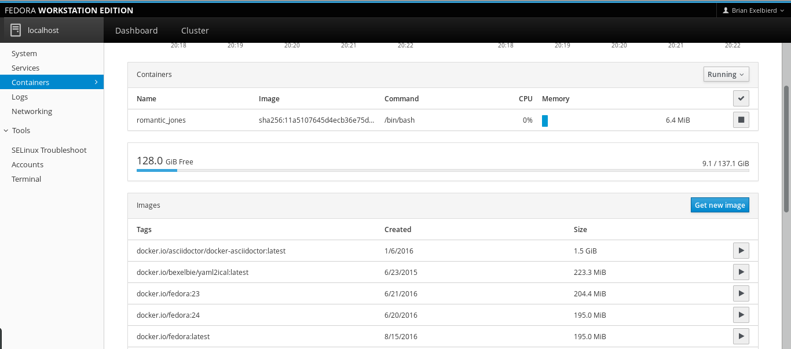
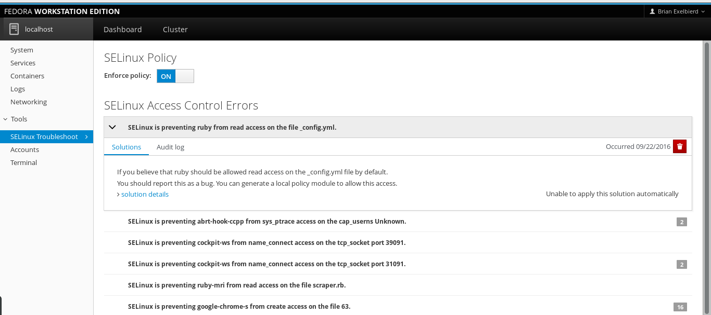
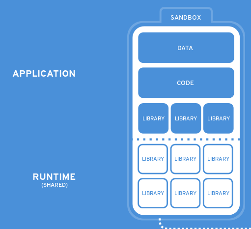

<!--Meta author:'Brian (bex) Exelbierd'-->
<!--Meta title:fedora-25-beta-->
<!--Meta description:'What's New in Fedora 25 Beta'-->
<!--Meta theme:solarized-->
<!--Meta history:true-->
<!--Meta center:false-->
<!--Meta width:1280 height:800-->

<!--sec-->
## What's New in Fedora 25 Beta
### and some tech explanations

Brian (bex) Exelbierd (@bexelbie)

Fedora Community Action and Impact Lead

https://github.com/bexelbie/bexelbie-talks-demos/ Fedora-25-Beta

FUDCon LATAM @ Puno, Peru - 12 October 2016

<!--sec-->
## Warning

### These are just highlights

For more details, see the Release Notes and download a copy :)

<!--sec-->
## What is the Beta Release?

A beta is code-complete and should look like the final release.

Please test the beta, even in a virtual machine.  Make sure what you use works.

Every bug you find and report doesn't just help you, it improves
the experience of millions of Fedora users worldwide!

Together, we can make Fedora rock-solid. Our fixes go upstream.  We make the world rock-solid.

<!--sec-->
## Progress Across All Forms of Fedora

Fedora is not just one thing.

- Fedora Workstation
- Fedora Server
- Fedora Atomic
- Fedora Spins

It takes a talented and professional community to make this happen.

<!--sec-->
## Fedora-Wide Changes

- Docker updated to version 1.12
- Node.js updated to version 6.x
- "Secondary architectures" now known as "alternate architectures"
- Support for the Rust programming language
  - blazingly fast, and prevents almost all crashes, segfaults, and data races
- Additional Python versions
  - Standard versions 3.5 and 2.7 along with PyPy, PyPy3 and Jython
  - Additional installable versions 3.4, 3.3, and 2.6
- Removal of support for weak (1024-bit) certificate authorities

<!--sec-->
## Fedora Atomic

Fedora Cloud is now Fedora Atomic

- Base Image for VMs (including qcow2, raw, and Vagrant)
- Atomic Host image for container deployment
- Docker Image for container development

Fedora Atomic has a two-week refresh release cycle with major releases every six months.

Fedora 25 Cloud Base Beta is still available to users who need it.

<!--sec-->
## What is an Atomic Host

- An optimized OS configured for container deployment.
- The OS is delivered as a read-only OS Tree.  This enables single command upgrades and rollbacks.
- Configuration is done via /etc files as normal
- Applications are all delivered in containers (no `dnf`)

<!--sec-->
## Fedora Server

- Cockpit
  - includes the SELinux Troubleshooter to help with problems
    - The GUI will suggest fixes and keep you having to notice the problem and dig through logs
  - Displays host SSH keys in the system dashboard
  - Includes support for network teaming, Docker volume, and storage management as well as the creation of systemd timer units
  - Supports multi-step (including 2FA) authentication 
- FreeIPA identity management system is upgraded to 4.4

<!--sec-->
## What is Cockpit

A web-based graphical management system for Linux systems.  It makes it
easy to manage your machine and see everything at a glance.

Let's see some screenshots!

<!--sec-->

<!--sec-->

<!--sec-->

<!--sec-->
## Installing Cockpit FIXME-test

It's easy!

    $ sudo dnf install cockpit`
    $ sudo systemctl start cockpit

There are additional packages for some features.  See the full list with:

    $ sudo dnf list cockpit*

And it's available in Fedora 24!

<!--sec-->
## Fedora Workstation (1/2)

- GNOME 3.22. Helpful new features include:
  - multiple file renaming
  - a redesigned keyboard settings tool
  - many other UI improvements across the environment
- GNOME Shell extensions are no longer checked for compatibility
  - GNOME 3 is stable enough to not need this
- Wayland by default
  - Wayland replaces X11 display system
  - X11 can still be installed if necessary

<!--sec-->
## Fedora Workstation (2/2)

- New Fedora media writer
  - Downloads the latest stable Fedora and makes it easy to write to media like USB
  - Creates live images that can be tested before install
  - Available for Windows, Mac OS, and Linux
- Improved Flatpak support in the Software tool

<!--sec-->
## What is Flatpak FIXME - how can I put the picture on the right of the bullets?

* Framework for distributing desktop applications
* Allows for multiple versions of apps to be installed
* Security and Isolation built in
* Stabalizes the underlying runtimes

See http://flatpak.org for details and documentation.

<!--sec-->
## Fedora Spins - KDE Desktop

New packages include:

- Minuet: Utility for learning music
- KRDC: Remote desktop client
- KMahjongg: Solitaire mahjongg 

Improvements include:

- Kontact suite: Improved feature set
- Kdenlive: Better video edits 

<!--sec-->
## Fedora Spins - Xfce

- xfce4-terminal:
  - Ported to gtk3 and vte291
  - Lots of bugfixes
  - Support for unlimited scrollback buffer
  - Support for magnet links, zooming
  - Tons of translation updates 
- xfce4-power-manager:
  - Bunch of bugfixes and translation updates. 
- xfce4-notifyd:
  - Ported to gtk3
  - Better theming capabilities. 
- Xfce live image now contains Firefox 

<!--sec-->
## Fedora Spins - Mate-Compiz

- MATE-1.16 
- Complete switch to GTK+-3 toolkit version 

<!--sec-->
## Fedora Spins - Design Suite FIXME

- Inherit batch renaming for Nautilus file manager: a welcome feature for photographers
- Inclusion of fonts like Molot and Grand Hotel (needed for Fedora Magazine)
- GNOME Photos available as a preview 

- Named Best of the Basics by MakeUseOf

<!--sec-->
## Alternative Architectures

F25 Beta is being released for Power64 and 64-bit ARM (AArch64)

And yes, there is a beta of Fedora Workstation on the Raspberry Pi

<!--sec-->
## Issues and Details

Contact the Fedora QA team via the mailing list or in #fedora-qa on Freenode

Common issues are tracked on the Common F25 Bugs page: https://fedoraproject.org/wiki/Common_F25_bugs 

For tips on reporting a bug effectively, read "how to file a bug report." https://fedoraproject.org/wiki/How_to_file_a_bug_report 

<!--sec-->
# Thank You

The GA of Fedora 25 is expected in November, 2016

- Brian (bex) Exelbierd (@bexelbie - bex@pobox.com)
- Slides: https://github.com/bexelbie/bexelbie-talks-demos/ Fedora-25-Beta
- Fedora 25 Release Notes: FIXME
- Fedora Downloads: https://getfedora.org
- Fedora Spins: FIXME
- Fedora 25 Release Schedule: https://fedoraproject.org/wiki/Releases/25/Schedule 
