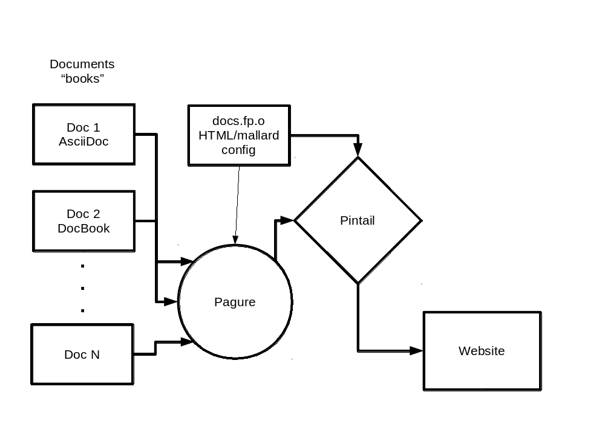

<!--Meta author:'Brian (bex) Exelbierd'-->
<!--Meta title:docs-fedora-->
<!--Meta description:'Fedora-Docs Update and Hackfest'-->
<!--Meta theme:solarized-->
<!--Meta history:true-->
<!--Meta width:1280 height:800-->

<!--sec-->
## Hackfest: Fedora Docs Learn and Hack

Brian (bex) Exelbierd (@bexelbie) and Pete Travis (randomuser)

https://github.com/bexelbie/bexelbie-talks-demos/ Flock.2016.docs

Flock @ Kraków, Poland - 4 August 2016

<!--sec-->
## Thanks

This update would not have been possible without the assistance of Pete
Travis (randomuser), Zach Ogelsby (zoglesby) and Shaun McCance (shaunm).

<!--sec-->
## Regrets

Regrettably, Pete cannot be here today.

<!--sec-->
## Agenda

- Recent changes in the Fedora-Docs Project
- Current ideas about what tomorrow will probably look like
- Interactive: How to configure your machine and submit a change today
- Hackfest

<!--sec-->
### Recent changes in the Fedora-Docs Project

- We had a FAD in Raleigh in May 2016
  - Move toward topic-based writing and structure
  - Tools Considerations: AsciiDoc + Pagure +  Pintail
  - Renew efforts at cooperation with partners (Red Hat, CentOS, etc.)

https://communityblog.fedoraproject.org/event-report-fedora-docs-fad/

<!--sec-->
## The Plan - Topics

- Every page is Page 1
- Easier to add material
- Search and consumption friendly
- Still very much under discussion and definition

<!--sec-->
## The Plan - Tools

<!--sec-->
## Open issues/challenges

- How do we transform our books into topic collections
- Training material for topic-based writing
- Contributor Guides
- Pintail issues
- Handling Common Content (Legal, etc.)
- Versions
- Translation code completion

<!--sec1.1-->
### Where we are with the new tooling

Changes ...

<!--sec2.1-->
## Interactive
### How to configure your machine and submit a change today

<!--sec2.2-->
- dnf install -y 
- git fork
- git checkout pagure
- git remote add
- git branch
- test build
- git add
- git commit
- PR

<!--sec-->
## Questions?

- Brian (bex) Exelbierd (@bexelbie - bex@pobox.com)
- Slides: https://github.com/bexelbie/bexelbie-talks-demos/ Flock.2016
- Fedora Docs Project: https://fedoraproject.org/wiki/Docs_Project?rd=DocsProject
- IRC: #fedora-docs
- Weekly IRC Meeting: Mondays at 1400 GMT in #fedora-meeting

### ... and now Hackfest
