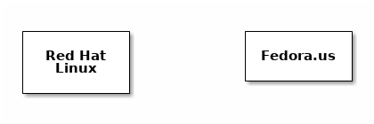
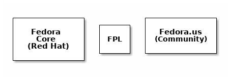
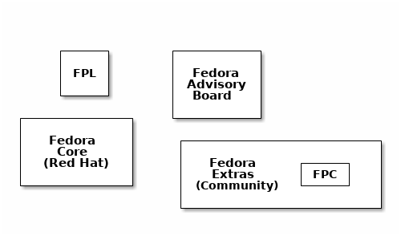
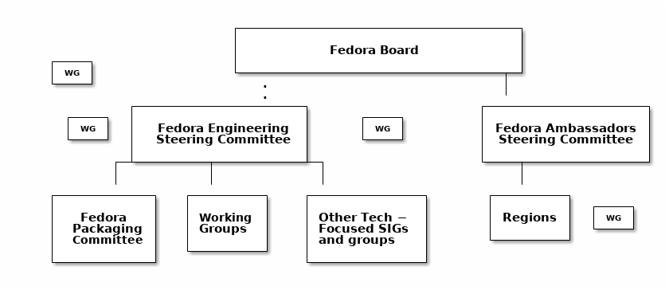
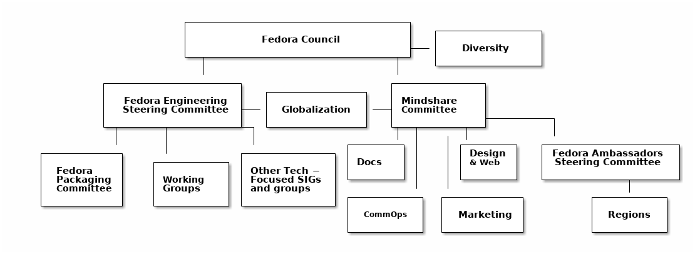
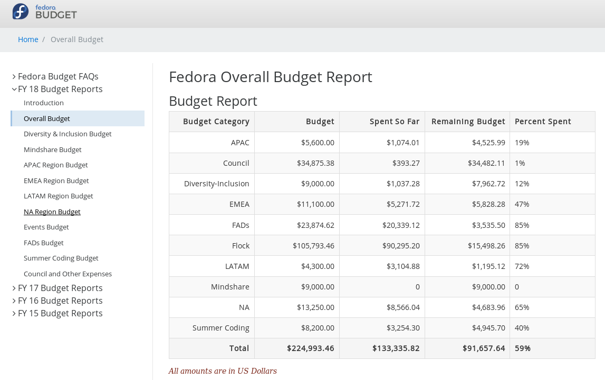
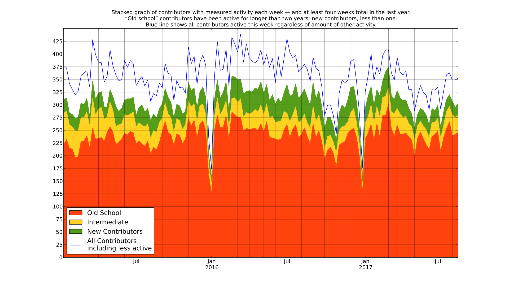

<!--Meta author:'Brian (bex) Exelbierd'-->
<!--Meta title:secret-to-keeping-community-strong-->
<!--Meta description:' The Secret to Keeping Your Community Strong for Decades: Open source software communities, as well as the individuals and the companies that form them, are constantly evolving. Come learn about how the Fedora community grows, evolving its governance, mission and community while staying true to its values for over a decade. In this talk, we’ll use real-life examples of community members who have become involved in Fedora, how we empower people to grow their local communities and how we bring them together globally. We’ll cover real examples that communities are faced with and the processes they’ve evolved to deal with them, from encouraging diversity to managing regional budgets to onboarding new contributors.'-->
<!--Meta theme:solarized-->
<!--Meta history:true-->
<!--Meta width:1280 height:800-->
<!--Meta center:false-->

<!--sec-->
## The Secret to Keeping Your Community Strong for Decades

Brian (bex) Exelbierd (@bexelbie) 
Fedora Community Action & Impact Coordinator (FCAIC) 
Red Hat

SFScon, Bozen, South Tyrol, Italy - 10 November 2017

<!--sec-->
## Agenda

- Evolving Governance
- Global and Local Communities
- Budgets
- Onboarding New Contributors
- Encouraging Diversity

<!--sec-->
## What is the Fedora Project?

- A complete operating system and software set
- A community infrastructure
- 350+ active contributes each week
- Corporate Sponsor
- Started in 2003 - 27th Release ships soon

<!--sec-->
### Governance: 2002

<!--sec-->
### Governance: 2003 - 2004

Open, Free, Innovative, Forward-Looking

<!--sec-->
### Governance: 2004 - 2006

Infinity, Freedom, Voice

<!--sec-->
### Governance: 2007 - 2012

The Code Merges! 
Independence is a key value 
The Fedora Project's mission is to lead the advancement of Free and open source software and content as a collaborative community. 

<!--sec-->
### Governance: 2013 - Today

Fedora creates an innovative platform for hardware, clouds, and containers that enables software developers and community members to build tailored solutions for their users.

<!--sec-->
## Global Community

Online, Flock, FUDCon, FADs

### Challenges
- Balancing "talk" and "do"
- Making Flock Global
- FUDCons are confusing
- FADs are challenging &nbsp;

### Solution?
Communication

<!--sec-->
## Local Community

- Ambassadors are the representatives of Fedora to the world
- Divided into four Regions with Budget Authority &nbsp;

### Challenges

- Regions were not defined by Fedora
- Regions work regionally but need to execute locally
- Some ambassadors are not active in other areas
- Some groups in Fedora are hard to contact &nbsp;

### Solution?

Mindshare Commitee

<!--sec-->
## Budgets: 2003 - 2013

- Black Box Budgets
- Historical Precedence is a Driver
- Money is rooted with the Ambassadors &nbsp;

### Challenges

- "Ask Red Hat" leads to uncertainty
- Almost everything has to be regionally justified
- Planning is hard if you can't see the balances

<!--sec-->
## Budgets: 2014 - Today

- Community has a known budget
- The Council allocates project wide
- Transparent budget @ budget.fedoraproject.org &nbsp;

### Challenges

- Communication
- Numbers are scary
- Change is scary

<!--sec-->
#### budget.fedoraproject.org

<!--sec-->
## Budgets: 2014 - Today

- Community has a known budget
- The Council allocates project wide
- Transparent budget @ budget.fedoraproject.org &nbsp;

### Challenges

- Communication
- Numbers are scary
- Change is scary

<!--sec-->
#### Fedora's Contributors (mostly)

<!--sec-->
### Onboarding New Contributors

#### Challenges
- What does contribution mean right now?
- Which contributors to focus on
- Direct contribution is often not what people think
- Docs are key for user and contributor onboarding &nbsp;

#### Solutions
- Join SIG maintaining WhatCanIDoForFedora.org
- 7 Fedora Classroom Intro Skills Sessions
- Docs team has made it easier to contribute and project information is next to traditional documentation
- Considering a History/Why project to learn more about our community

<!--sec-->
## Encouraging Diversity

### Successes
- Active Diversity Team
  - Fedora Women Day is our big success
  - 10 events this year; 2 last year

### Challenges

- Reviewing our Code of Conduct
  - Reporting mechanism is vague
  - What do with a report
- Diversity Survey of our Community
- Mindshare or Council?
- Diversity Advisor

<!--sec-->
## Notes

- Governance dates are approximate
- Image Credit
  - Org Charts (before today): Brian Exelbierd
  - Org Chart (today): Fedora Project
  - budget.fedoraproject.org website
  - Contributor Graph: 2017 State of Fedora Talk by Matthew Miller
- The Legal Bits
  - All images in this presentation are copyright their respective owners and are used under a Creative Commons License or considered fair use.
  - This presentation is licensed CC BY-SA 4.0. Please use, remix and share widely!  For license information, see https://creativecommons.org/licenses/by-sa/4.0/

<!--sec-->
## Thank You

- Brian (bex) Exelbierd | bexelbie@redhat.com | bex@pobox.com
- Fedora Community Action & Impact Coordinator
- @bexelbie | http://www.winglemeyer.org
- Slides: https://github.com/bexelbie/bexelbie-talks-demos/ DIRNAME

